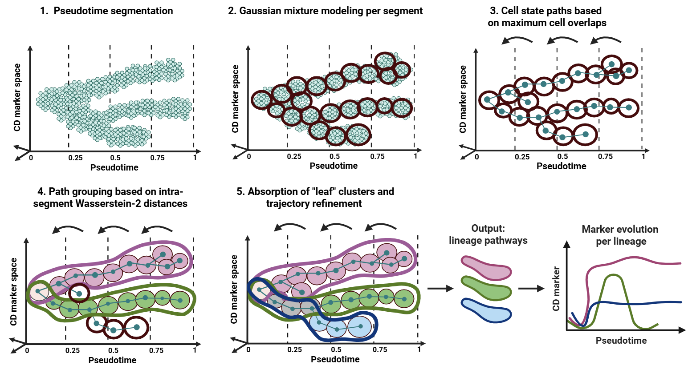

# TimeFlow2: an unsupervised cell lineage detection method for flow cytometry data

**Authors**: Margarita Liarou, Thomas Matthes, and Stéphane Marchand-Maillet.

Manuscript available [**here**](https://www.biorxiv.org/content/10.1101/2025.11.01.685988v1.abstract)



This repository contains the Python 3.11.3 source code for TimeFlow 2, as well as tutorials to reproduce lineage inference using the healthy bone marrow P1-BM dataset with both Gaussian Mixture Model (GMM) and FlowSOM. All Python scripts are available in the src folder. 

## Datasets

To reproduce the lineage inference analysis of P1/2/3-BM patients, use the healthy bone marrow datasets that contain 20 CD markers and a pseudotime estimated (as estimated by [**TimeFlow**](https://onlinelibrary.wiley.com/doi/full/10.1002/cyto.a.24928)). These pre-processed datasets are stored in The Open Science Framework, under the folder [**datasets**](https://osf.io/u275b/files). Raw FCS files are available [**here**](https://osf.io/ykue7).

## Results
All lineages detected automatically by TimeFlow 2 are stored in CSV files (with and without cell labels) in the The Open Science Framework, under the folder [**results**](https://osf.io/u275b/files).

## Requirements

The Python requirements are the following:

- Python version: 3.11.3

Python Package versions:
- fastdtw==0.3.4
- flowsom==0.0.3
- joblib==1.2.0
- numpy==1.24.4
- pandas==1.5.3
- pygam==0.9.0
- scanpy==1.10.4
- tqdm==4.67.1
- 
## Contact
Please contact us at *margarita.liarou@unige.ch* for any question about TimeFlow 2. 

##  Citation 
The BibTeX for TimeFlow is the following:

```
@article{liarou2025timeflow,
  title={TimeFlow 2: an unsupervised cell lineage detection method for flow cytometry data},
  author={Liarou, Margarita and Matthes, Thomas and Marchand-Maillet, St{\'e}phane},
  journal={bioRxiv},
  pages={2025--11},
  year={2025},
  publisher={Cold Spring Harbor Laboratory}
}
```

## License
TimeFlow 2: an unsupervised cell lineage detection method for flow cytometry data is licensed under the Creative Commons Zero v1.0 Universal License. More information can be found [**here**](https://github.com/MargaritaLiarou1/TimeFlow2/blob/main/LICENSE).
